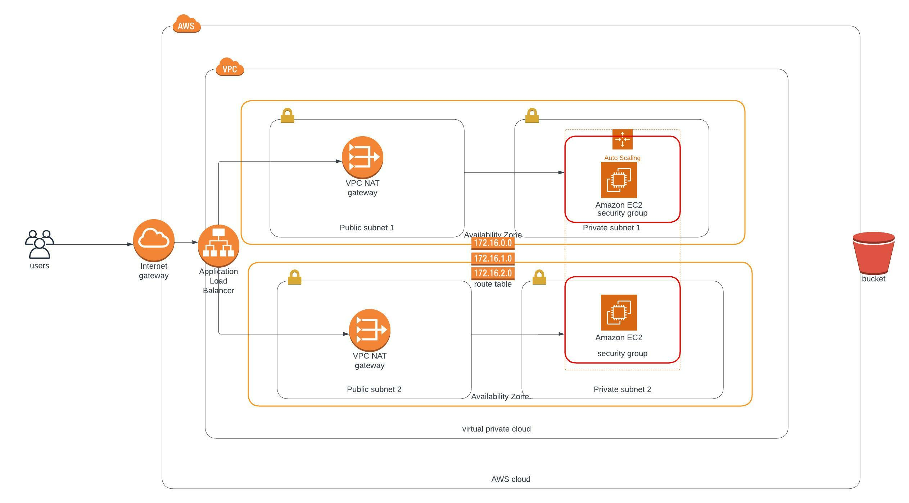

# AWS CloudFormation script for high availability web app

### This project aims to deploy a high available web app using Cloud Formation script written in `YAML`.
### It first creates the networking component (VPC, Subnets, Nat gateways, Internet gateways) and then creates the server components (LoadBalancer, Launch Configuration, AutoScaling group a health check, security groups and a Listener and Target Group).
 
 

# Architecturer Diagram

 
 

# Running the scripts

### Example for Network infrastructure
``
./create_stack.sh UdacityUdagramNetwork network.yml network_parameters.json 
``

### Example for Server infrastructure

``
./create_stack.sh UdacityUdagramServer server.yml server_parameters.json
``